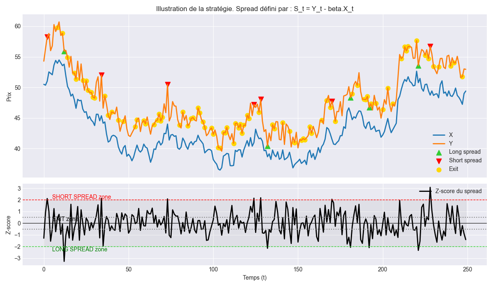

# Statistical Arbitrage Framework

## Description générale

Ce projet implémente une **stratégie de Statistical Arbitrage (Stat Arb)** multi-paires sur actions et futures, combinant :
- backtesting robuste,
- sélection dynamique de paires,
- construction et agrégation de portefeuille neutre au marché,
- analyse de performance avec comparaison à des benchmarks.

L’objectif est de construire un **portefeuille neutre au risque** (delta ≈ 0) générant de l’alpha stable et indépendant de la direction du marché.

---

## Architecture du projet

```
algo-trading-stat-arb/
├── config/
│   └── params.yaml                # Paramètres globaux : seed, fréquence, capital, ratios train/val/test
│
├── core/                          # Modules fondamentaux
│   ├── backtest.py                # Backtest pair trading, calcule PnL, equity et journal de trades
│   ├── hedge_ratio.py             # Estimation du beta entre deux actifs (OLS, rolling ou expanding)
│   ├── loader.py                  # Chargement et prétraitement des données prix
│   ├── pair_selection.py          # Sélection initiale et filtrage de paires
│   ├── utils.py                   # Fonctions utilitaires (sharpe, drawdown, etc.)
│
├── experiments/                   # Scripts d'expérimentation complets
│   ├── run_batch.py               # Lancement de backtests sur tout l'univers de paires
│   ├── run_walkforward.py         # Version walk-forward du backtest (réestimation dynamique du beta)
│   ├── generate_mixte_results.py  # Combine les résultats Static/WF en un modèle mixte
│   ├── validate_final.py          # Sélectionne le portefeuille final (10 paires optimales)
│   ├── aggregate_portfolio.py  # Agrège les paires pondérées et construit l'équity du portefeuille
│   ├── compare_portfolio.py       # Compare Static / WF / Mixte sur les métriques globales
│   ├── trade_analyzer.py          # Analyse détaillée de tous les trades (PnL, durées, ratios)
│   ├── benchmark_compare.py       # Compare la stratégie à un benchmark neutre ou au S&P500
│
├── results/                       # Résultats produits automatiquement
│   ├── trades/                    # Détails de tous les trades (Static, WF)
│   ├── equities/                  # Courbes d’équity par paire
│   ├── final_portfolio_*.csv      # Portefeuille sélectionné (10 paires)
│   ├── portfolio_equity_*.csv     # Courbes d’équity globales
│   ├── compare_portfolios_summary.csv
│   ├── trades_summary_*.csv
│   └── walkforward_summary.csv
│
└── README.md                      # Présent fichier
```

---

## 🧠 Logique de la stratégie

### 1️⃣ Univers
- Ensemble d’actions US (ou européennes) téléchargées via **Yahoo Finance**.
- Chaque paire (X, Y) est évaluée selon leur **corrélation** et **co-intégration**.

### 2️⃣ Modélisation
On modélise le spread :

$$ S_t = Y_t - \beta_t X_t $$

- $\beta_t$ estimé soit **statique** (OLS), soit **walk-forward** (expanding window).
- Z-score calculé pour déterminer les zones d’entrée et de sortie.

### 3️⃣ Signal de trading
Positions ouvertes/fermées selon le z-score :

```python
enter_long  = z < -entry_z
enter_short = z >  entry_z
exit_all    = abs(z) < exit_z
```

- **Long spread** : achat du sous-performant, vente du surperformant.
- **Short spread** : inverse.
- Fermeture quand le spread converge vers sa moyenne.

<p align="center">
  
</p>


### 4️⃣ Gestion du portefeuille
- Capital total : **10 000 €**.
- Allocation selon les **poids optimaux** du portefeuille final.
- Chaque paire est indépendante, PnL exprimé en **rendement relatif**.

### 5️⃣ Neutralité de marché
- Les positions long/short compensent leur exposition au bêta.
- Portefeuille **delta-neutre** → corrélation ≈ 0 avec le marché.

---

##  Modules détaillés

### 📈 `core/backtest.py`
- Backtest une paire (Y, X) donnée :
  - Calcule le spread et le z-score.
  - Détermine les entrées/sorties.
  - Produit un `trades_df` complet :
    - EntryTime / ExitTime  
    - Entry/Exit prices  
    - PnL par actif et total  
    - Durée du trade  
    - Raison de sortie  
- Retourne :  
  `equity`, `pnl`, `sharpe`, `max_dd`, `trades_df`.

### 🧠 `core/hedge_ratio.py`
- Calcule le **beta** de couverture entre deux actifs :
  - `fit_beta_static()` → OLS sur tout l’historique.  
  - `fit_beta_expanding_monthly()` → estimation glissante (walk-forward).

### 📚 `core/loader.py`
- Charge et nettoie les prix des actifs.  
- Gère les alignements de timezones, ffill/bfill, et interpolation.

---

### 🚀 `experiments/run_batch.py`
- Lance un backtest sur tout l’univers d’actifs.
- Sauvegarde les équities individuelles (`results/equities/static/`).
- Produit les CSV des performances par paire.

### 🔁 `experiments/run_walkforward.py`
- Version dynamique : le beta est recalculé de manière **expanding**.  
- Journalisation automatique des trades via `ExecutionLogger`.

### 📊 `experiments/aggregate_portfolio.py`
- Agrège les résultats de chaque paire sélectionnée dans le portefeuille final.
- Pondère chaque paire selon `weight * initial_capital`.
- Calcule Sharpe global et PnL total.

### 🧾 `experiments/validate_final.py`
- Sélectionne les **10 meilleures paires** selon un score :
  \[
  score = \frac{Sharpe}{MaxDrawdown}
  \]
- Attribue des poids normalisés.
- Sauvegarde `final_portfolio_Static.csv`.

### ⚖️ `experiments/compare_portfolio.py`
- Compare les performances des versions :
  - **Static** (beta fixe)
  - **WF** (walk-forward)
  - **Mixte**
- Calcule : Sharpe, Sortino, CAGR, MaxDD, etc.

### 📈 `experiments/trade_analyzer.py`
- Analyse microstructurelle des trades :
  - Nombre, PnL moyen, Win rate, durée moyenne.
  - Distribution des PnL par paire et globalement.
  - Heatmap des meilleures paires.
- Exporte `trades_summary_*_pondéré.csv`.

### 📉 `experiments/benchmark_compare.py`
- Compare ton portefeuille neutre au marché :
  - Benchmark : S&P 500 ou ETF neutre (ex : `BTAL`, `ARB`).
- Calcule :
  - **Sharpe**, **CAGR**, **Beta**, **Corrélation**, **Max Drawdown**.
- Génère une courbe comparative *Strategy vs Benchmark*.

---

## Pipeline d’exécution

### 🔹 Étape 1 — Backtests par paire
```bash
  python -m experiments.run_batch
```

### 🔹 Étape 2 — Sélection du portefeuille final
```bash
  python -m experiments.validate_final --mode Static
```

### 🔹 Étape 3 — Construction du portefeuille global
```bash
  python -m experiments.aggregate_portfolio --mode Static
```

### 🔹 Étape 4 — Analyse et comparaison
```bash
  python -m experiments.compare_portfolio
  python -m experiments.trade_analyzer
  python -m experiments.benchmark_compare
```

---

## 📄 Exemple de résultats (Static)

| Metric | Valeur |
|--------|---------|
| Sharpe global | 4.34 |
| Performance totale | +84.21 % |
| Max Drawdown | -3.2 % |
| Corrélation SPX | 0.01 |
| Beta SPX | 0.04 |

---

## ⚙️ Paramètres clés (`config/params.yaml`)

```yaml
# ==========================
# Paramètres généraux
# ==========================
seed: 42
freq: "1H"
train_ratio: 0.7
val_ratio: 0.15
test_ratio: 0.15
initial_capital: 10000
```

---

## 🧠 Points forts du framework

- ✅ **Cohérence du capital** (pas de nominal, pas de double pondération)
- 💾 **Logging complet** des trades et performances
- 📊 **Analyse multi-niveaux** : paire / portefeuille / marché
- 🧮 **Vraie neutralité de marché** : beta ≈ 0, corrélation ≈ 0
- 🧱 **Architecture modulaire** (chaque bloc testable indépendamment)

---

## 🚀 Extensions possibles

- 🤖 Ajout d’un modèle ML pour la **sélection dynamique de paires**
- 📈 Optimisation des poids via **Mean-Variance / Kelly**
- 🔁 Intégration API broker (Interactive Brokers, Alpaca)
- 🧰 Ajout d’un **risk engine** (VaR, CVaR, stress tests)
- 📄 Génération automatique de **rapports PDF de performance**

---

## Auteur

**Émile**  
Étudiant à l’**École Centrale de Lyon (2021–2025)**  
Projet de recherche en **trading algorithmique et arbitrage statistique**
